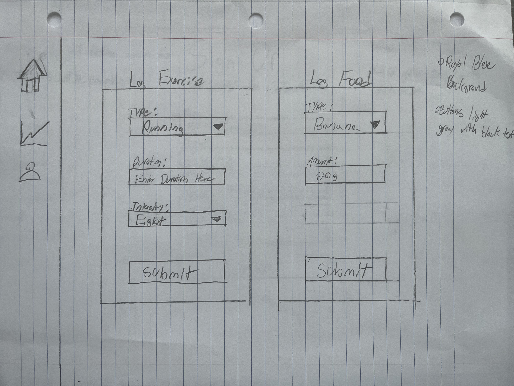
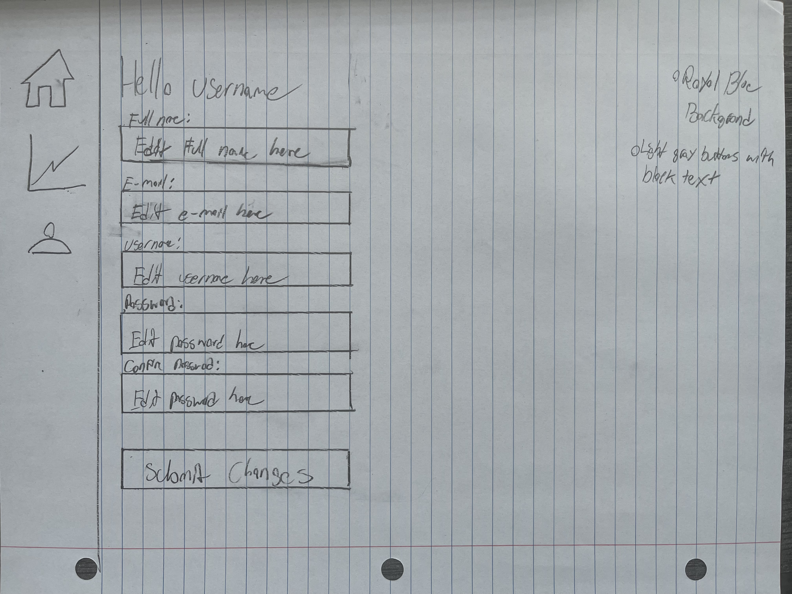

# Design Document For Web App
Font Type:
Entire site will feature Futura Font

Color Scheme:
Primary Color: #3498db (Royal Blue)
Secondary Color: #2ecc71 (Emerald Green)
Accent Color: #e74c3c (Alizarin Crimson)

Different Button Color Options:
Button: Royal Blue with white text
Button: Emerald Green with white text
Button: Alizarin Crimson with white text
Button: Light gray with slightly darker text

Pages and Functions:

Home Button directs to Dashboard, User Button directs to Profile Page, “Graph” Button directs to Log Page

a. Signup/Login Page:
Input fields for username and password on login page
Input fields for name, email, username, password on sign up page
Button: Login

b. Dashboard:
Overview of daily/weekly progress

c. Log Exercise/Food:
Dropdowns for exercise type, and intensity. 
Input Field: Duration
Button: Log Exercise
Dropdown for food type
Input Field: food amount
Button: Log Food

d. Profile Page:
View and edit personal information
Input Boxes: Change username, change email, change password, change name
Button: Save Changes

User Table:

UserID (Primary Key)
FullName
Username
Email
Password

Exercise Log Table:
LogID (Primary Key)
UserID (Foreign Key)
ExerciseType
Duration
Intensity
Date

Nutrition Log Table:
LogID (Primary Key)
UserID (Foreign Key)
FoodItem
Quantity
Calories
Date

