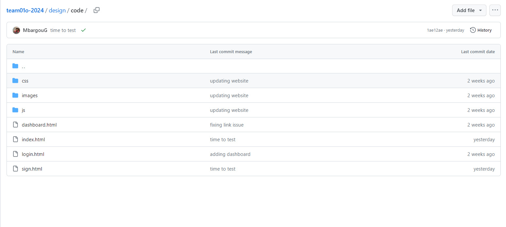
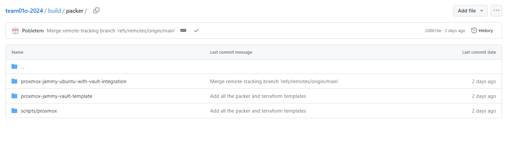
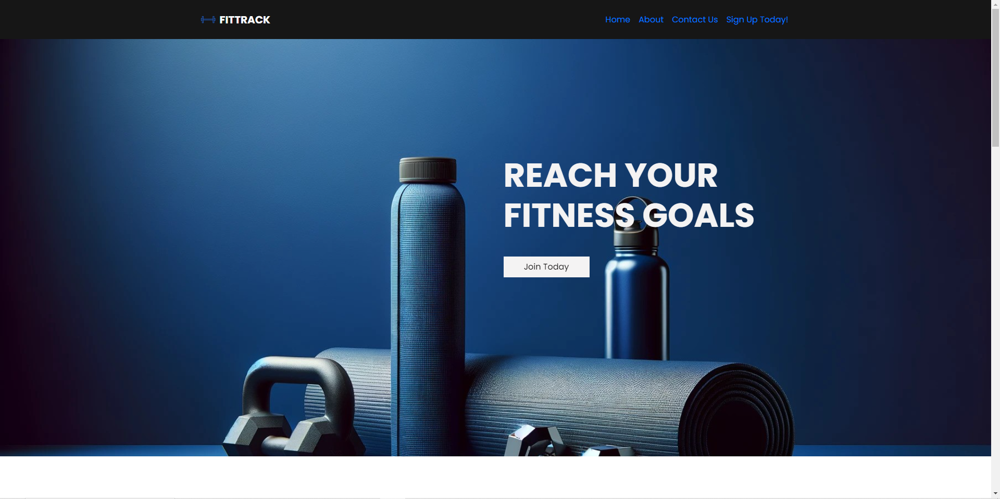
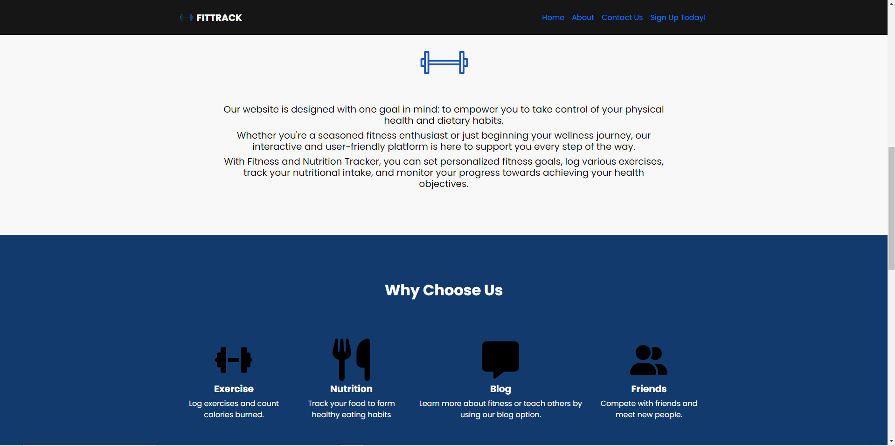
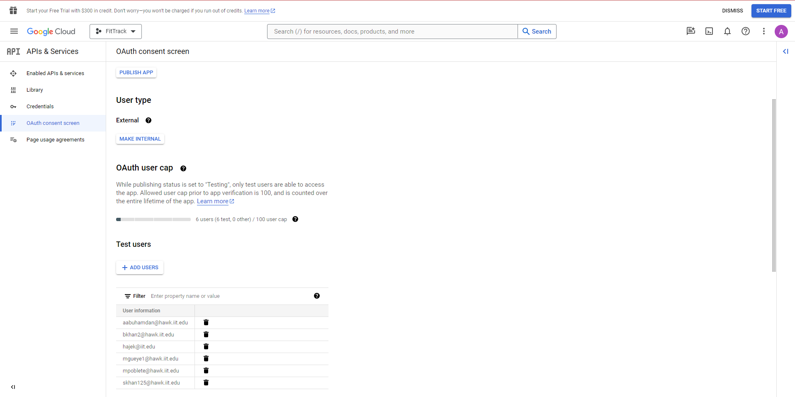
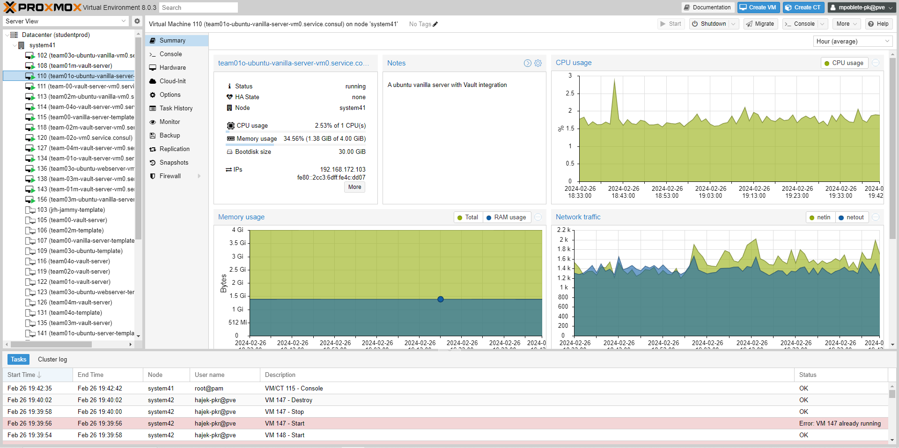

# Sprint-02 Project Manager Report

## Introduction of your teammates

Project Manager - Azzam Abu Hamdan
Developer 1 - Bisma Khan
Developer 2 - Mbargou Gueye
UI/UX and User Testing - Sufyan Khan
IT Operations and Security - Martin

# Introduction

This sprint02 focused on the development of our fitness tracker app, fittrack. For this sprtint, we began the intiial development of our application. This included the implementation of a login/signup page, the UI design and associated program, along with building the ubuntu server to host our application, and finally implement authentication.

# Project Management Tool

We continued to use Trello for this sprint to manage the individual tasks that we had to do for our respective roles, along with how far we were with each task. The 25 points were split up between the tasks based on difficulty and importance, along with the use of PRIORITY tags.

# Team Set Up Items

We created the code and build folders that hold our code and the information needed for our server. We are also utilizing our chosen languages in the code folder.

# Site with Log In

We ended up implementing the designs we made in the previous sprint, and we can see the home, about, and sign up pages along with a login page below. These functionalities all work, though we don't have the database to hold the inputted information yet, and that is something were oging to implement in the next sprint.

# Use your @hawk accounts and Google OAuth for login 
OOne of our developers set up Google OAuth, though it isn't implemented fully on the site yet, we are working on that for next sprint

# Choice of Server OS
Martin, who had the IT and Security role, got the server up and running, along with getting our application hosted on the server as well. 

# Conclusion
In conclusion our sprint was successful, and we were able to effectively complete major parts of our site, including the login and sign up pages, along with the home page. Along with the UI of the site, we completed the functionality portion of the sign up and login page. To add, we successfuly got the build and ubuntu server running and hosted our application on there. We also worked on the authentication, and started the implementation of Google Auth into our application. Though we had our deliverables marked in our project management tool, Trello, we were unable to complete all of our tasks fully. Though, the progress we made was very substantial, and with many of the tasks almost done we will be completing them in Sprint03. This includes the implementation of a readme and build templates for ease of installation, along with the creating of bash and powershell scripts for deployment. We also will fully implement a database, along with the Auth.

