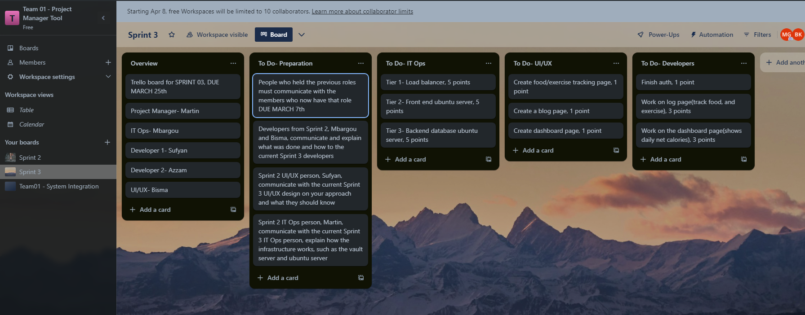
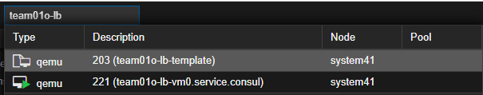
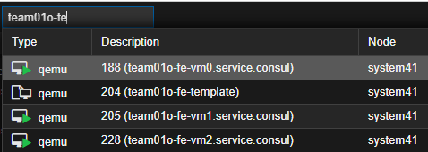
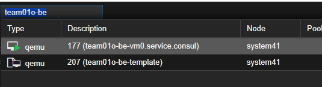
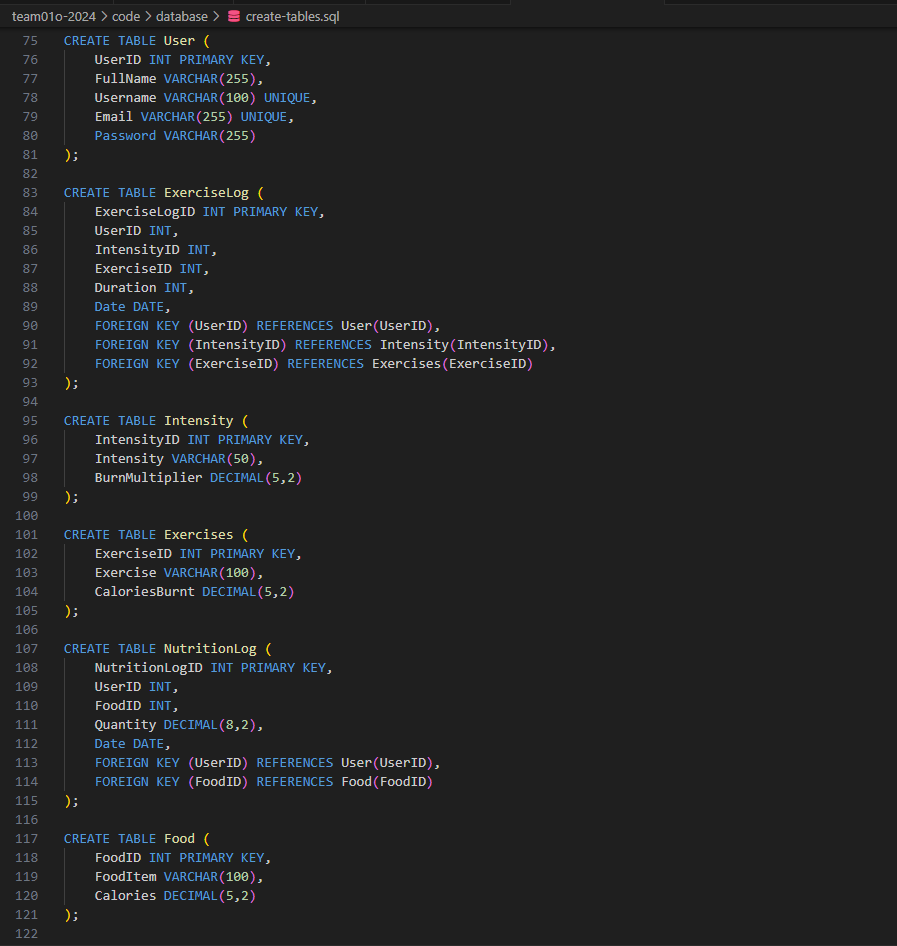
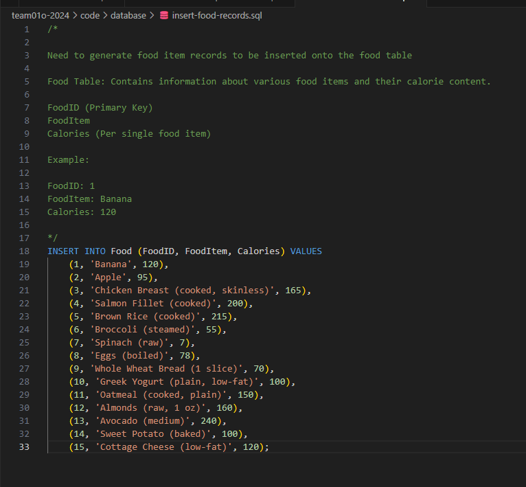
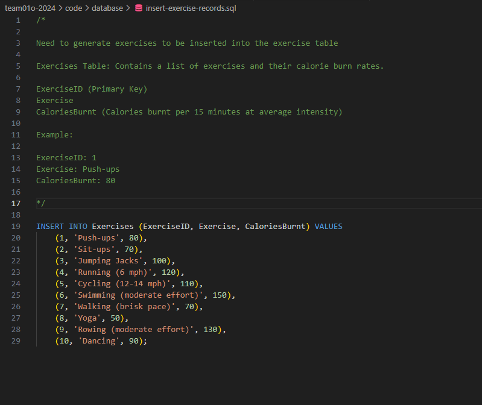
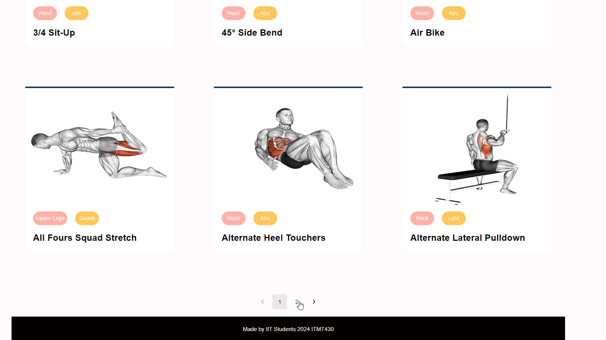
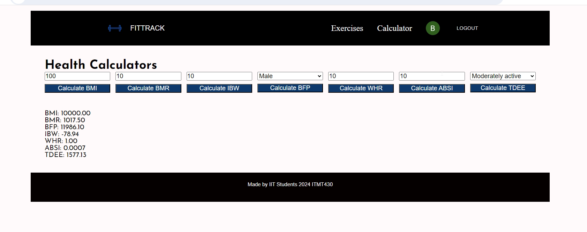

# Sprint-03 Project Manager Report

## Introduction of your teammates

Project Manager - Martin

Developer 1 - Sufyan

Developer 2 - Azzam

UI/UX and User Testing - Bisma

IT Operations and Security - Mbargou

# Introduction

In sprint 03 the team focused on creating a proper three tier infrastructure and adding more functionality to our fitness tracker app. This sprint began with a frontend packer template and server which was manually hosting our webapp. Our webapp only had basic functions such as a home page with some information, a login page, and a signup page, but these pages were just skeletons with no functionality.

By the end of sprint 03, we were able to deploy a three tier infrastructure although we are still working on hosting our webapp on our front end, we also made some of the databases we need for the webapp and inserted some records into them. Due to complications and our lack of experience we werent able to fully implement our front end development with our infrastructure since our infrastructure took us longer than we initally estimated, this lead to our developers building the website on the localhost for testing purposes, our webapp has a working authentication method with google auth, a calculator page that calculates different things about the user such as BMI, and an exercise page in which users can select which exercises they did to log them. We also were able to catch up on a few things from last sprint, such as developing our scripts for automated install, and developing a small guide to help future IT Ops persons.

# Project Management Tool

We continued to use Trello for this sprint to manage the individual tasks that we had to do for our respective roles. The 25 points were split up between the tasks based on difficulty and importance.

# Team Goals and Deliverables

As shown in our trello board we initially set a plan for a few specific deliverables, the first being of our infrastructure.
Our infrastructure can be broken down into 3 main pieces each a tier of the three tier webapp. The other deliverables were for our UI/UX designer to make a 

## First tier

First tier is that of our load balancer, we both were able to create the template and deploy it with terraform

Main contributor: Martin

## Second tier
The second tier is that of our front end, we were able to create the template and deploy it with terraform, however due to time constraints and other issues we were not able to make a template that hosts our current webserver, we were only able to create and deploy the template and vm using sample code, this was done in the end so the three tier deployment could be tested even if we didnt have time to fully work on the front end. This task will be technical debt that we will make up in the coming week and sprint.

Main contributor: Martin, Mbargou

## Third tier
The third tier is that of our back end, which hosts our database. We were able to create the template and deploy it with terraform for our backend. Since we couldnt properly finish our front end it was hard to test our back end, but our database and tables were created and they simply need to be connected to our front end when it is properly configured.

Main contributor: Martin, Azzam

## Database and records for Backend
These are the database tables and records we are using for our backend

Main contributor: Azzam

# UI/UX and development team

Due to the issues on our infrastructure and frontend we were left delayed for all development on our webapp, however instead of being bottlenecked our development team decided it would be a better use of time to develop part of the website in localhost. This let our development team still be able to work on and make strides in our web application. While we understand some of the items that were developed will need to be changed to fit the three tier infrastructure our developers took care to make sure that most of the things they developed would be able to be seemlessly translated onto our front end and three tier infrastructure without too many painful changes.

## Google Auth and log in page
Our google auth working, in this case it is a localhost webpage, again due to our issues with the frontend this sprint. But this shows us we can get it working and implemented into our FE come next sprint

Main contributor: Bisma

## Sample/Prototype exercise page
A sample of what our exercise page is and would look like once implemented. Again due to issues it is in a localhost page and the values like the images and exercises are hard coded in but once we configure it properly we will be able to show it in our front end

Main contributor: Bisma, Sufyan

## Calculator Page
This page calculates bmi and other information and it will be very easy to implement into our front end as we dont need much more than the code already written.

Main contributor: Bisma, Azzam

 

# Conclusion
In conclusion our sprint was quite messy this time around, but overall I think for what issues we ran into both in our personal lives and the issues of dealing with a lot of new concepts and information, we did a good job of still being able to produce good work that put us one step forward in our projects goal. We were able to get the infrastructure templates and vms deployed, with the caviat of some still needing configuring, but overall the three tier structure is there and we know it works and thats a good step forward for us. We were also able to get work done on our website even if it had to be hosted locally this time around, the experience our developers gained from working on it will be very useful in future sprints, our developers feel more comfortable in dealing with things like Google Auth and other features that we want for our webapp and they will also be able to directly implement some of the features they developed locally into our infrastructure without much issue. Overall this sprint was tough for us but that made it a very valuable learning experience for us as we have become more adept at the DevOps way of dealing with these situations and have gained personal insight as to when things start to go off-schedule in a project and how we may go about turning those moments around in the future.

