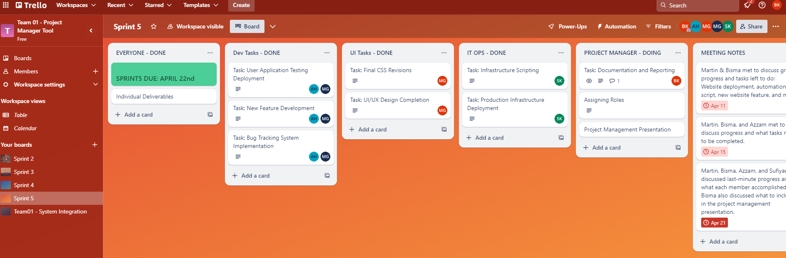
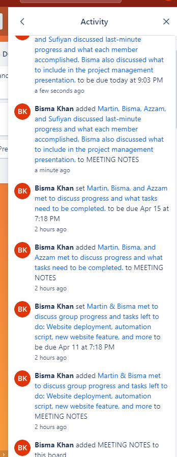
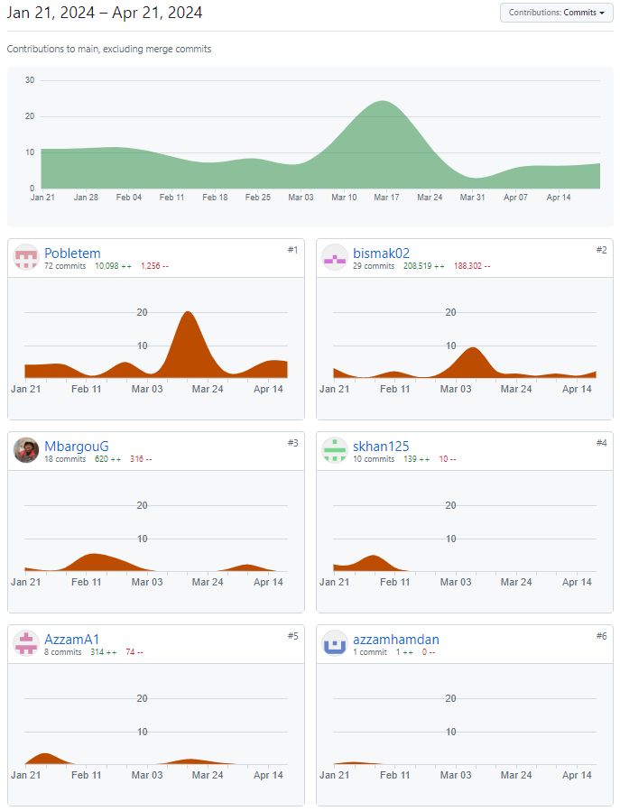
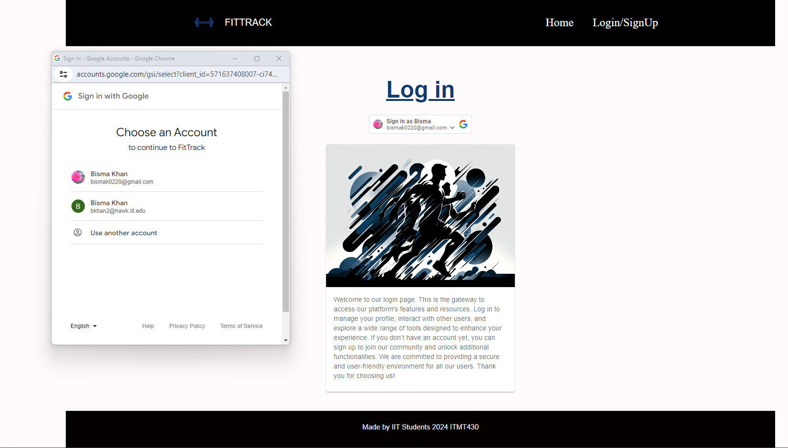
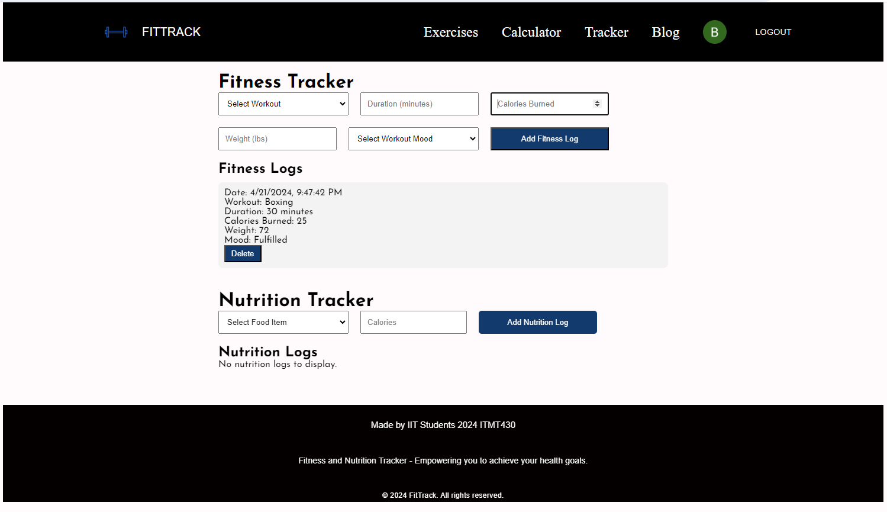

# Sprint-05 Project Manager Report

## Introduction of Teammates
### Our team for this project comprises five dedicated members:

- **Bisma**, serving as the Project Manager, ensures tasks are assigned, artifacts delivered, and project boards are updated.
- **Azzam**, Developer 1, focuses on backend development and integration.
- **Guy**, Developer 2, works alongside Azzam on developing new features and maintaining the codebase.
- **Sufiyan**, IT Operations and Cyber Security, manages our infrastructure and security.
- **Martin**, UI/UX Designer, is responsible for the design and user experience.

## Project Summary
This presentation outlines our project's development process, demonstrates our project management tools, and showcases our application's deployment and functionality. We will walk you through our development journey, highlighting the tasks assigned and accomplished, supported by GitHub commit charts and our Kanban Board. Each team member will demonstrate their contribution to deploying and operating the application.

## Project Management Tool Demonstration
Our project management was conducted using Discord and Trello. Initially, the following items were assigned:

- Deploy and explain user application testing
- Deploy and explain uses of bug tracking and creation of GitHub issues
- Deploy final CSS revisions to match the original site plan
- Complete one new feature
- Deploy to Production Infrastructure
- Demonstrate usage of webapp
- Create new ubuntu vm and try to deploy webapp.

Each of these items has been accomplished, as evidenced by our GitHub commit charts showing the progression of code contributions and updates as well as our discord messages. The Trello Board highlights how tasks moved from "To Do," through to "Done."

## Application Deployment and Demonstration
The application was fully deployed on proxmox. Each component, including the backend server, database, and front-end application, was set up and configured to ensure seamless operation. 

I will now demonstrate:

1. **Login of a user**: Here, a user logs into the system using their credentials.

2. **Uploading Progress**: After logging in, the user can track their nutrition and fitness. 
3. **Editing their Progress**: The user can then log out and back in and change any progress

Here are the images of the team members ability to log in and perform these steps to confirm the functionality and collaborative aspects of the application:

- Bisma

- Martin
- Gueye
- Sufiyan
- Azzam

## Conclusion
In conclusion, our project successfully integrated multiple components of software development, from initial planning and design to deployment and testing. The tools and methods we utilized facilitated effective teamwork and project management. This report and our presentation have documented our journey, showcasing both challenges and achievements. We have demonstrated how collaborative efforts coupled with robust project management can lead to the successful completion of a software project.