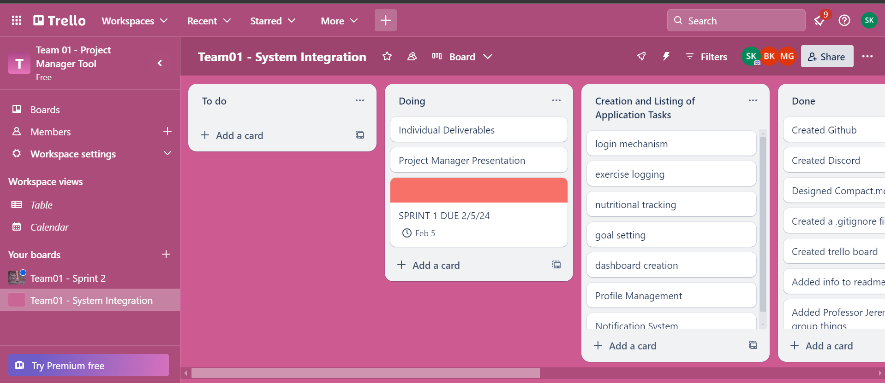
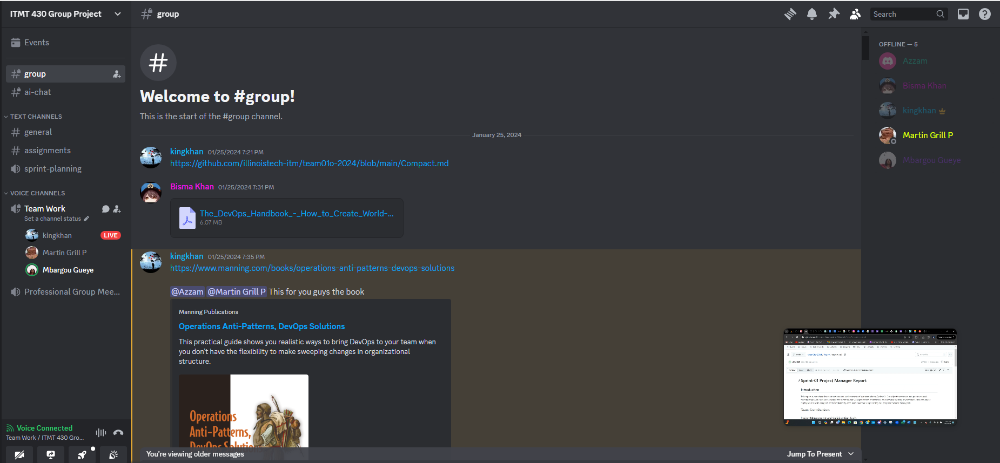

# Sprint-01 Project Manager Report

## Introduction

This report summarizes the contributions and achievements of our team during Sprint-01. Our objectives were to set up our project's foundational tools, outline the design for our three-tier web application, and foster a collaborative working environment. This document highlights the tasks assigned and completed by each team member, emphasizing our progress towards these goals.

## Team Contributions

### Project Management and Collaboration Tools

#### Trello Setup
- Contributors Sufyan Khan, Bisma Khan
- Description Established our project management framework using Trello, ensuring a smooth workflow and effective task tracking.
- Artifact 

#### Discord Setup
- Contributor Sufyan Khan
- Description Configured Discord for team communication, integrating notifications from Trello and GitHub to streamline our collaboration.
- Artifact 

### Documentation and Team Guidelines

#### Team Charter
- Contributor Bisma Khan
- Description Drafted a comprehensive Team Charter to outline our collaboration protocols, work ethics, and conflict resolution strategies.
- Artifact 

#### Project `.gitignore`
- Contributor Martin Grill Poblete
- Description Created a `.gitignore` file to maintain our repository's integrity by excluding unnecessary files and sensitive information.
- Artifact 

#### Project `Readme.md`
- Contributor Martin Grill Poblete
- Description Compiled a `Readme.md` for our repository, detailing team composition and project objectives.
- Artifact 

#### Project `About.md`
- Contributor Sufyan Khan
- Description Developed an `About.md` document to define the scope and general function of our proposed project.
- Artifact 

### Design and Planning

#### UIUX Design Document
- Contributor Azzam Abu Hamdan
- Description Created detailed UIUX design documents, setting a solid foundation for our application's interface and user experience.
- Artifact 

#### Entity Relationship Diagram (ERD)
- Contributors Martin Grill Poblete, Mbargou Gueye
- Description Drafted an ERD to outline our database schema, crucial for the application's data management strategy.
- Artifact 

### Task Management

#### Application Tasks Listing
- Contributor Mbargou Gueye
- Description Broke down the project into manageable tasks, listed in our project management tool to guide our development efforts.
- Artifact 

## Conclusion

During Sprint-01, our team set up the basics for our project. We worked well together and planned everything carefully. Everyone's work was really important for starting our web application project. We're excited to keep working on this solid start in our next sprints.

